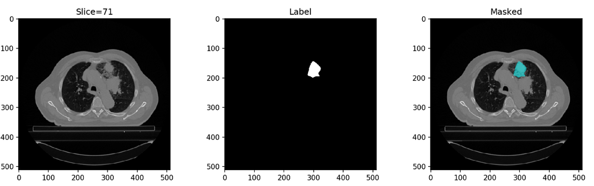

# Non-small-cell lung carcinoma (NSCLC) segmentation
The original dataset is from [data](https://www.kaggle.com/c/ai-for-clinical-data-analysis-hw2/).  
Evaluation metric: dice coefficient

### Data: 
- Chest CT images 
  - DICOM files
  - Each slice with 512 × 512 pixels
- Tumor Labels
  - NIFTI files
  - Same shape with corresponding CT image

### Network structure:  

The network has similar struture with [U-Net: Convolutional Networks for Biomedical Image Segmentation](https://arxiv.org/pdf/1505.04597.pdf) and is implemented in Keras.

The depth of the encoder and decoder is set to 3.

The output from the network is a 512\*512 mask, representing the label pixels ([0, 1] range) of the input image.

### Training
The model is trained for 15 epochs.

After 15 epochs, the validation dice coefficient is about 0.3.

The binary crossentropy loss function is chosen for training.

Loading the dicom image requires large ram. Instead of using model.fit() for training, I implement a module called LungSliceModelGenerator  to efficiently train the model using batch by batch image loading. You can either implement your own generator in python by using [yield](https://anandology.com/python-practice-book/iterators.html).  

See function LungSliceModelGenerator for detail.
